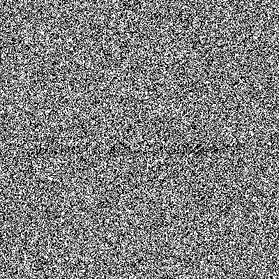
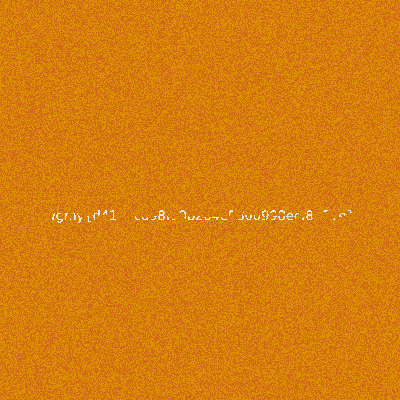
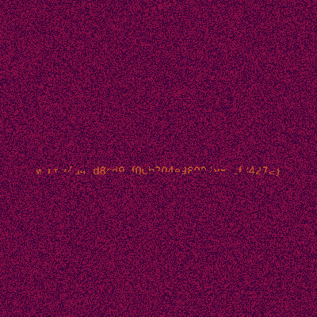
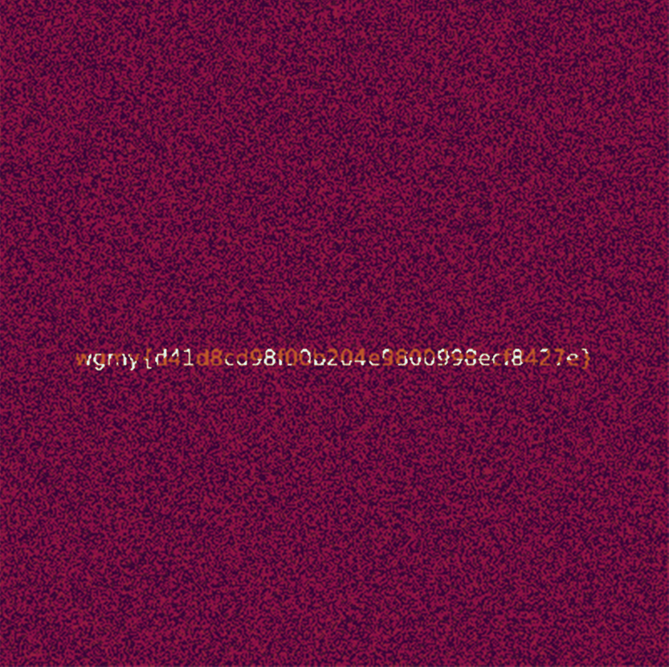

# Invisible Ink
Invisible Ink GIF: [Resources/challenge.gif](Resources/challenge.gif)

# Approach
Using stegsolve, extract frame 5 and 6 of the GIF with Frame Browser. Put frame 5 and 6 through stegsolve and obtain colour mapped image. 
<table>
    <tr>
        <th>Frame 5 (Original)</th>
        <th>Frame 5 (Colour Mapped)</th>
    </tr>
    <tr>
        <td></td>
        <td></td>
    </tr>
</table>
<table>
    <tr>
        <th>Frame 6 (Original)</th>
        <th>Frame 6 (Colour Mapped)</th>
    </tr>
    <tr>
        <td></td>
        <td></td>
    </tr>
</table>
Using any photo editor (we used Photoshop) and overlay the two images to get the flag text.

# Flag
wgmy{d41d8cd98f00b204e9800998ecf8427e}